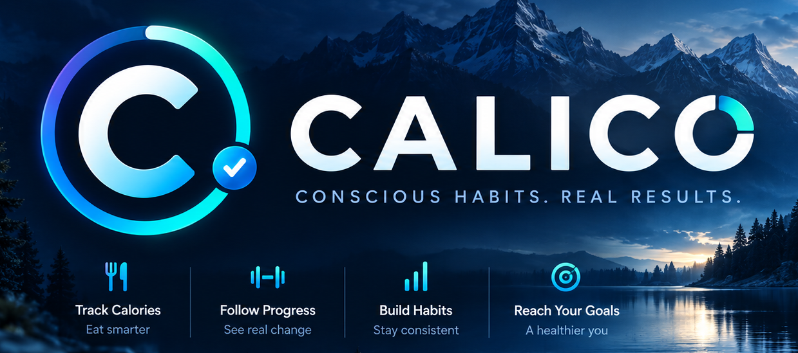

# CALICO



CALICO is a simple log for calories, macronutrients, body weight and waist circumference. Entries are added through a form or by pasting a text template. The app uses no AI and no natural-language parser. It is meant for home use on a LAN.

## What it does

- keeps daily entries per user (4–8 digit PIN),
- records: `Weight`, `Waist`, `Breakfast`, `Lunch`, `Dinner`, `Snack`, `Daily balance`,
- calculates the day's total kcal and macros, and the kcal target (Mifflin-St Jeor × activity × goal adjustment),
- `Log`: edit, duplicate, move and delete entries, undo the last change, clear a day,
- `Progress`: 7/30/90 days, month, custom range — calories vs target, balance, highest day, weight trend (7-day average),
- data export and import as a simple "one row = one day" CSV (an empty template can be downloaded from the app).

## Interface

Mobile-first, dark theme following the branding (`docs/UI design.md`): navy cards, cyan/teal accents, a progress ring as the main motif.

- **Today** – "Add meal" button in the top right corner, calorie ring (intake / target), macros (progress towards the target in g), weight and waist cards with mini charts, 7-day consistency ("on target" = ±10% of the kcal target), calorie target and the recommendation from the plan review.
- **Log** – monthly calendar (dot = day with entries: teal – food, blue – measurements only; tap to select a day) and meals grouped as Breakfast, Lunch, Dinner, Snacks, Daily balance, Measurements; tapping an entry opens actions: edit, duplicate, move, delete.
- **Progress** – 1M/3M/6M/1Y/All/Custom: weight chart (with 7-day trend), waist, calories against the target, weekly consistency, day history.
- **Goals** – current plan (start date can be changed), macro targets, plan weight vs average, target weight with forecast, plan review and accepting suggestions.
- **Settings** – profile and plan, PIN change, CSV export/import, language (polski / English), account deletion.

Navigation (Today, Progress, Goals, Log, Settings, Log out): bottom bar on phones, side panel from 960 px (with the signed-in user's name above "Log out"). Adding and editing happen in bottom sheets. The Inter font (OFL) is bundled locally (`frontend/fonts/`) – the app downloads nothing from the internet.

### Languages (PL / EN)

The interface, API messages, text templates and CSV files work in Polish and English. The switch is on the login screen and in `Settings`. The choice is remembered on the device and on the account: after signing in, the account language applies. On first launch with no choice made, the browser language is used (Polish or English).

- Polish is the source language: texts are written in Polish in the code and in `index.html`, and English translations live in the dictionaries `frontend/js/locales/en.js` and `backend/app/locales/en.py`. The key is the Polish text.
- Frontend: `t("Tekst {param}", { param })`, `N_("Etykieta")` for constants, `plural(n, "dzień", "dni", "dni")`. Static text and attributes (`placeholder`, `aria-label`, `title`, `alt`) in `index.html` are translated automatically.
- Backend: `t("Tekst {param}", param=...)` from `app/i18n.py`. The request language comes from the `Accept-Language` header (the frontend sends the selected language).
- Completeness is enforced by `scripts/check_i18n.mjs` and `backend/tests/test_i18n.py` (in CI): a text without an EN translation, an unused translation, or Polish text bypassing `t()` blocks the PR.
- Entry labels and `source_text` are stored in Polish in the database (canonical form). The API returns them in the request language (EN: `Dinner 2` instead of `Kolacja Druga`). The template parser understands both languages (`Breakfast` / `Calories: 540`, `Date:`). CSV: PL – semicolon and decimal comma, EN – comma and decimal point. Import accepts both.

### PWA and icons

- `frontend/manifest.json`, `frontend/sw.js` (app shell cache; `/api` data is never cached).
- Icons in `frontend/icons/` are generated by a script from the files in `branding/`:

```bash
docker run --rm -v "$PWD:/repo" -w /repo python:3.12-slim \
  sh -c "pip install -q pillow && python scripts/generate_icons.py"
```

- Installing as an app (Android/Chrome, desktop) requires HTTPS or `localhost` – browsers do not start a service worker over plain `http://` on a LAN. On iOS, "Add to Home Screen" also works over HTTP (`apple-touch-icon`).

## Key rules

- **The profile is mandatory and has no default values.** After the first PIN unlock, a new user must complete the profile: sex, age, height, current weight, activity, goal and goal adjustment. The dialog cannot be closed or skipped; the only alternative is switching user. Until then the data API returns `428`.
- "Today" is computed in the `APP_TIMEZONE` time zone (default `Europe/Warsaw`).
- Entry date: from `2000-01-01` up to and including tomorrow.
- `Weight`, `Waist`, `Daily balance`: one entry per day, a new one overwrites the previous one. An edit/move that would create a second such entry returns 409.
- Meals: any number per day, labelled `Breakfast`, `Breakfast 2`, `Lunch 2`, `Dinner 2`…
- `Daily balance` replaces the sum of that day's meals.
- The kcal target is a **plan**, not a formula result recalculated after every weigh-in. It changes only explicitly:
  - saving the profile = a new plan calculated from the "plan weight" (saving with a changed weight also creates today's `Weight` entry),
  - accepting a suggestion from the "Plan review" card (`Goals` tab).
- `Weight` entries are for monitoring: the profile shows the current weight next to the plan weight, but the target does not change.
- Plan review (`app/plan.py`): weight trend from a regression of measurements since the plan start (min. 4 measurements spanning 14 days), compared with the rate implied by the plan. Within range → target unchanged, even if the estimated TDEE has dropped. Out of range → "keep watching" for the first 21 days, then a suggested adjustment of 100–200 kcal (not below 1500 kcal for men / 1200 kcal for women). When food entries cover ≥ 70% of days, TDEE is also estimated from actual intake and weight change.
- A target change updates today's and future days' targets; past days keep their target.
- Target weight (optional, `Goals` tab) is used only for the forecast: the date it will be reached is calculated from the weight trend in the plan review, or without a trend, from the rate implied by the plan. It does not change the kcal target (D2b).
- Macro targets (g) are by default derived from the day's kcal target: protein 25% and fat 30% of energy, carbs fill the rest (constants `MACRO_AUTO_*` in `services.py`). Custom targets in the `Goals` tab are optional – each field separately, empty = automatic; if you enter only protein or fat, carbs still fill the kcal target. Changing macro targets does not change the kcal plan. On "Today" the bars show progress towards the target; exceeding it is shown in amber.
- Reports compute averages and days above/below target only from days with a food entry (meal or daily balance).
- Value ranges: kcal 0–10,000, macros 0–1,000 g, weight 30–300 kg, waist 30–250 cm.

## Text templates (Log → "Paste text")

```text
Weight: 82.4 kg
```

```text
Waist: 91 cm
```

```text
Breakfast
Calories: 540
Carbs: 48
Fat: 18
Protein: 32
```

Headers: `Breakfast`, `Lunch`, `Dinner`, `Snack`, `Daily balance`. Numbers with a comma or a dot, units optional. Polish templates work too (`Śniadanie`, `Ilość kalorii: 540`, `Węglowodany`, `Tłuszcze`, `Białko`), with or without Polish diacritics (`Sniadanie`, `Ilosc kalorii`).

A different day — first line `Date:` (`YYYY-MM-DD`, `DD.MM.YYYY`, `DD-MM-YYYY`, `DD/MM/YYYY`):

```text
Date: 2026-08-03
Dinner
Calories: 610
Carbs: 40
Fat: 22
Protein: 38
```

Text commands (whole message): `show today`, `undo`, `delete 2`, `help` (Polish: `pokaż dziś`, `cofnij ostatni`, `usuń 2`, `pomoc`).

## Getting started

### Run the published image (recommended)

Images are published to the GitHub Container Registry for `linux/amd64` and `linux/arm64` (e.g. Raspberry Pi 4/5 with a 64-bit OS). You only need `docker-compose.yml` and `.env.example` from this repository:

```bash
cp .env.example .env          # review the settings, see "Configuration" below
docker compose up -d
```

Open `http://localhost:8380` (or `http://<server-ip>:8380` from another device on your network). On first launch there is no user and no default PIN – the app asks you to create the first user (name and PIN) and then requires completing the profile. The PIN can be changed in `Settings`.

| Image tag | What it is |
|---|---|
| `ghcr.io/pbuzdygan/calico:latest` | newest stable release (from `main`) |
| `ghcr.io/pbuzdygan/calico:X.Y.Z` | a specific stable release, e.g. `0.1.0` – pin this for predictable upgrades |
| `ghcr.io/pbuzdygan/calico:dev_latest` | newest development release (from `dev`) – may be unstable |
| `ghcr.io/pbuzdygan/calico:devX.Y.Z` | a specific development release, e.g. `dev0.2.0` |

Upgrade: `docker compose pull && docker compose up -d`. The database is migrated automatically on start (schema version in the `app_meta` table, key `schema_version`). Export your data from `Settings` before upgrading – there is no automatic backup.

### Build locally (development)

```bash
cp .env.example .env
docker compose -f docker-compose-local-build.yml up --build -d
docker compose -f docker-compose-local-build.yml logs calico --tail=100
```

`docker-compose-local-build.yml` builds the image from the source (`backend/Dockerfile`, build context = repository root) with the same hardening options as the deployment file, so local tests match production behaviour.

### Notes

- The app runs in a single container: FastAPI serves both the API and the frontend files. Data is stored in the `calico_data` volume (`/data/calico.db`). The container runs as an unprivileged user (UID 1000) with a read-only root filesystem; only `/data` and `/tmp` are writable.
- Existing installations keep their users (including the former "Domyślny Użytkownik" default user – it can be deleted after creating your own account). Old keys in `.env` (`APP_ENV`, `DEFAULT_USER_PIN`, `ADMIN_PIN`, `DIAGNOSTICS_PATH`) are ignored and can be removed.
- Upgrading from the old Caddy-based version (two containers, `backend` + `proxy`): add `--remove-orphans` to the first `docker compose up`. The data volume stays the same.

## Releases

Container images are built **only when a GitHub release is published** – never on a push. Pushes and pull requests run the tests only (`.github/workflows/ci.yml`). The release tag decides the channel (`.github/workflows/release.yml`):

| Release tag | Must point to a commit on | Image tags |
|---|---|---|
| `vX.Y.Z`, e.g. `v0.1.0` | `main` | `:X.Y.Z`, `:latest` |
| `devX.Y.Z`, e.g. `dev0.2.0`, `dev0.2.0-rc1` | `dev` | `:devX.Y.Z`, `:dev_latest` |

The workflow runs the tests first and stops before pushing anything if the tag matches neither pattern, if the tagged commit is not on the channel's branch, or if a stable tag is published as a pre-release. Mark dev releases as pre-releases so GitHub keeps showing the latest stable one as "Latest". Stable and dev images never share tags or build cache.

Releasing: update `CHANGELOG.md` (rename `[Unreleased]` to the version and date), merge, then create the release in GitHub with a new tag on the right branch. After the first release, make the package public once in GitHub → Packages → `calico` → Package settings → Change visibility (new GHCR packages are private).

## Configuration (`.env`)

Every key is optional; `.env.example` explains each one in detail.

| Variable | Default | Description |
|---|---|---|
| `APP_TIMEZONE` | `Europe/Warsaw` | time zone used to determine "today" (IANA name) |
| `SQLITE_PATH` | `/data/calico.db` | database path; both compose files set it to the data volume |
| `ALLOW_SIGNUP` | `true` | `false` = new accounts can only be created on first launch (when no user exists); `POST /api/users` then returns `403`. Use `false` on any internet-facing instance |
| `SESSION_TTL_HOURS` | `12` | how long a session stays valid after a PIN unlock |
| `SESSION_SECRET` | empty | session signing key; empty = generated automatically and stored in the database |
| `CORS_ORIGIN` | empty | empty = no CORS (frontend and API on the same origin) |
| `API_DOCS` | `false` | `true` = interactive API documentation at `/docs`, `/redoc`, `/openapi.json` |
| `MAX_REQUEST_BYTES` | `4194304` | requests with a larger body are rejected with `413` |

## API

Messages and texts in responses use the language from the `Accept-Language` header (`pl` by default, `en`). All data endpoints require a `user_id` parameter (query or path) and authentication: `Authorization: Bearer <token>` (token from `POST /api/auth/verify`, valid for `SESSION_TTL_HOURS`) or the `X-User-PIN` header. Errors: `401` wrong PIN, `403` signup disabled, `404` object not found, `409` conflict (e.g. a second `Weight` entry on a day), `422` invalid data, `429` PIN locked after failed attempts, `428` profile not completed (applies to days, entries, reports, plan, export and chat).

Users and profile:

- `GET /api/users` (empty list = first launch), `POST /api/users` — `{"display_name": "Ala", "pin": "2468"}` (`403` when `ALLOW_SIGNUP=false` and a user already exists), `DELETE /api/users/{user_id}`
- `POST /api/users/{user_id}/pin` — `{"new_pin": "5678"}`; invalidates old tokens and returns a new one
- `PUT /api/users/{user_id}/language` — `{"language": "en"}` (`pl`/`en`); `POST /api/auth/verify` returns the stored `language`
- PIN lockout: after 5 failed attempts the account is locked for 5 min, subsequent series for 10, 20, 40 and max. 60 min (`429` with a `Retry-After` header, also for a correct PIN). A correct PIN resets the counter. An open session (token) keeps working. Constants `PIN_*` in `services.py`.
- `POST /api/auth/verify` — `{"user_id": 1, "pin": "1234"}` → `{"ok": true, "token": "…", "expires_at": "…"}`
- `GET|PUT /api/profile/{user_id}` — `is_complete=false` and empty fields until the profile is saved; `PUT` requires all fields. `weight_kg` is the plan weight, `current_weight_kg` is the latest measurement. `macro_targets`: effective targets `protein_g`, `fat_g`, `carbs_g` and `manual_*` (null = automatic)
- `PUT /api/profile/{user_id}/macros` — `{"protein_g": 170}`; fields optional (missing/null = automatic, `{}` restores automatic), ranges: protein 0–500, fat 0–400, carbs 0–1000 g
- `POST /api/profile/{user_id}/preview` — BMR/TDEE/target preview for form data (no save, works before the profile is completed)
- `PUT /api/profile/{user_id}/plan-start` — `{"plan_started_on": "2026-03-01"}`; manual plan start date (e.g. after importing historical data): not later than today, kcal target unchanged, plan weight = average of measurements from the 7 days before that date (without them – the first measurement up to 7 days after it)
- `PUT /api/profile/{user_id}/target-weight` — `{"target_weight_kg": 85}` or `null` (removes it); 30–300 kg
- `GET /api/profile/{user_id}/plan` — plan review (status, trend, TDEE, suggestion) and target weight forecast: `target_weight_kg`, `target_weight_remaining_kg`, `forecast_date`, `forecast_basis` (`trend` – from measurements in the last 28 days, including before the plan start / `plan`), `forecast_message`
- `POST /api/profile/{user_id}/plan/apply` — `{"target_kcal": 2460}` accepts the current suggestion (409 if it has changed)

Days and entries (reads never create a day in the database):

- `GET /api/days/current?user_id=`
- `GET /api/days?user_id=&limit=&date_from=&date_to=` — only days with entries (the date range is used by the Log calendar)
- `GET /api/days/{date}?user_id=` — day totals, entries and the day's macro targets `target_protein_g`, `target_fat_g`, `target_carbs_g` (derived from the day's kcal target; also in `GET /api/days` and `/api/days/current`)
- `POST /api/days/{date}/entries?user_id=` — `{"entry_type": "lunch", "kcal": 600, "carbs_g": 60, "fat_g": 20, "protein_g": 40}` or `{"entry_type": "weight", "weight_kg": 82.4}`
- `PATCH /api/days/{date}/entries/{id}?user_id=` — `{"entry": {...}}` or `{"source_text": "..."}`
- `POST /api/days/{date}/entries/{id}/move?user_id=` — `{"target_date": "2026-06-14"}`
- `POST /api/days/{date}/entries/{id}/duplicate?user_id=` — `{"target_date": null}` (null = same day)
- `DELETE /api/days/{date}/entries/{id}?user_id=`
- `POST /api/days/{date}/undo?user_id=` — removes the most recently added/changed entry of the day
- `POST /api/days/{date}/clear?user_id=`

Reports and export:

- `GET /api/reports/summary?user_id=&days=7`
- `GET /api/reports/range?user_id=&date_from=&date_to=` (max. 3660 days)
- `GET /api/reports/month?user_id=&month=YYYY-MM`
- `GET /api/export?user_id=` — "one row = one day" CSV. PL: `Data;Waga (kg);Obwód pasa (cm);Kalorie (kcal);Białko (g);Węglowodany (g);Tłuszcze (g)` (semicolon, UTF-8 with BOM, decimal comma); EN: `Date,Weight (kg),Waist (cm),Calories (kcal),Protein (g),Carbs (g),Fat (g)` (comma, decimal point). Meals are summed per day
- `GET /api/import/template?user_id=` — empty template in the same format (rows starting with `#` are skipped)
- `POST /api/import?user_id=` — `{"content": "<CSV text>"}` → `{"imported_days", "imported_entries", "skipped_dates", "errors": [{"row", "message"}], "error_count", "earliest_imported_date", "plan_started_on"}` (`earliest_imported_date` only when the imported data goes back before the plan start – the UI then suggests changing the start date). The whole file is validated first – if there are errors, nothing is saved. Days that already have entries are skipped. Calories and macros → "Daily balance" (macros optional), weight and waist → separate entries. Also accepts comma/tab as separator, headers in either language, with or without Polish diacritics and in any order, and `DD.MM.YYYY` dates

Text chat: `POST /api/chat/message` — the response has a `kind` field: `saved`, `info` or `error`.

Other: `GET /health`, `GET /api/meta` (server's today date, time zone, `allow_signup`).

## Tests

```bash
cd backend
docker run --rm -v "$PWD:/app" -w /app -e PYTHONPATH=/app python:3.12-slim \
  sh -c "pip install -q -r requirements.txt -r requirements-dev.txt && pytest -q -p no:cacheprovider"
```

Full check as in CI (ruff + pytest in a container, `node --check` of frontend modules locally): `./scripts/check.sh`. CI (GitHub Actions) runs the same on pushes to `dev`/`main`, on every PR and before every release image build.

## Security

CALICO was designed for a home network. What it protects against, and what you need to add yourself before exposing it to the internet:

**Built in**

- PIN hashed with PBKDF2-SHA256 (120k iterations), constant-time comparison. The PIN is never stored in the browser.
- After 5 failed PINs the account is temporarily locked (5 → 10 → 20 → 40 → 60 min).
- After unlocking, the browser receives a signed session token (HMAC-SHA256, valid for `SESSION_TTL_HOURS`) kept in `sessionStorage`: the session survives a tab reload (e.g. when a phone suspends the browser in the background) and disappears when the tab is closed or on logout. Changing the PIN invalidates all earlier sessions.
- `Content-Security-Policy`, `X-Content-Type-Options`, `X-Frame-Options`, `Referrer-Policy`, `Permissions-Policy`, `Cross-Origin-Opener-Policy`, `Cross-Origin-Resource-Policy` headers; no `Server` header; API documentation disabled by default; request body size limit.
- Container: unprivileged user, read-only root filesystem, all Linux capabilities dropped, `no-new-privileges` (see `docker-compose.yml`).
- SQLite in `WAL` mode, `foreign_keys=ON`; secrets kept out of the repo (`.env` in `.gitignore`).

**Known limits** – acceptable on a trusted home network, not on the open internet:

- The login screen lists all user names (`GET /api/users` needs no authentication).
- A 4-digit PIN with the lockout above can be guessed in weeks by a determined attacker, and anyone can lock an account out by entering wrong PINs. There is no per-IP rate limiting.
- The app speaks plain HTTP; it has no TLS of its own.
- On a fresh instance, whoever opens it first creates the first account.

**If you host it on the internet**, put it behind a reverse proxy (Caddy, nginx, Traefik) that provides:

1. HTTPS with a valid certificate (and HSTS),
2. an extra authentication layer in front of the whole app – e.g. a VPN (WireGuard, Tailscale), an identity-aware proxy (Authelia, Authentik, Cloudflare Access) or at least HTTP basic auth,
3. request rate limiting and a request size limit.

Also: create all accounts first, then set `ALLOW_SIGNUP=false`; publish the container port on localhost only (`"127.0.0.1:8380:8000"`); use 6–8 digit PINs. CALICO stores health data (weight, diet) – if you host it for other people, you are responsible for protecting it.

Reporting vulnerabilities: see [`SECURITY.md`](SECURITY.md).

## Project documentation

See [`CHANGELOG.md`](CHANGELOG.md) for what changed in each version.

Internal project documents are written in Polish (the project's working language).

- `docs/decisions.md` — product decisions and open tasks (source of truth for further work),
- `AGENTS.md` — instructions for AI agents,
- `docs/UI design.md` — visual system and UI rules (source of truth for the look).
